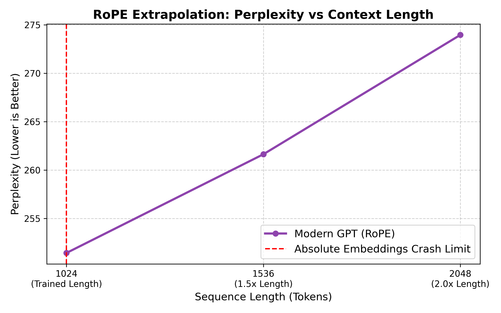
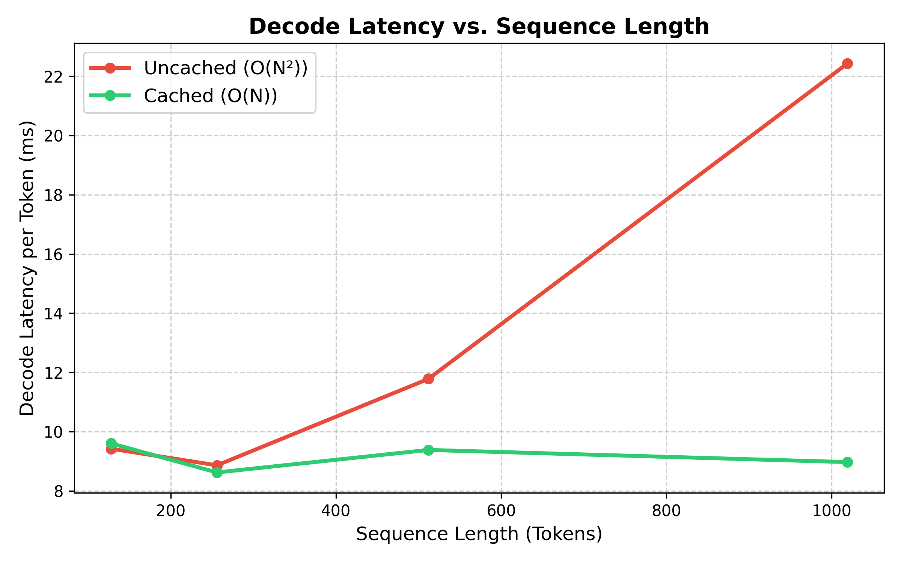
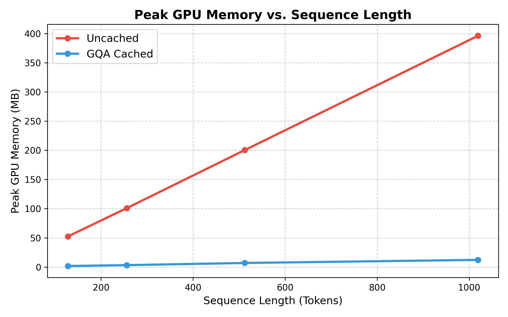
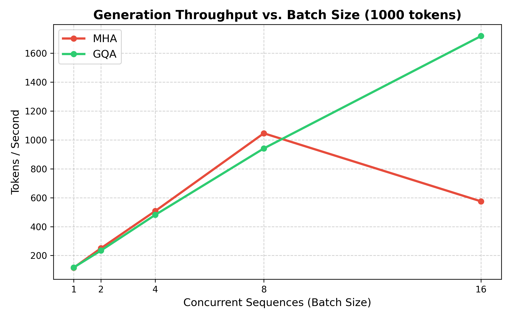
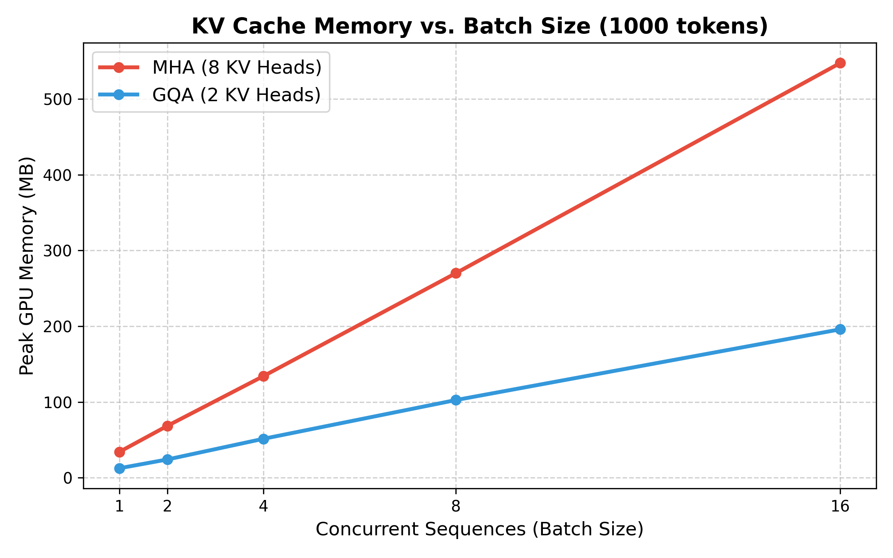

# Modern GPT Architecture & Inference Systems

PyTorch implementation of a decoder-only Transformer, modernized with RoPE, RMSNorm, SwiGLU and GQA, followed by cloud training and quantitative inference/serving benchmarks. 

This project completely strips down a vanilla GPT-2 baseline and replaces it with modern open-source standards (mirroring Llama-2/3 paradigms):
- **RoPE** (Rotary Positional Embeddings) for dynamic context extrapolation
- **RMSNorm** (Root Mean Square Normalization) for reduced computational overhead
- **SwiGLU** (Swish Gated Linear Unit) for improved gradient flow
- **GQA** (Grouped Query Attention) for massive memory footprint reductions during KV-caching

---

## 1. Cloud Infrastructure & Training Setup

The model (~30M parameters) was trained on a cloud GPU pipeline via AWS EC2:
- **Instance:** `g4dn.xlarge` (1x NVIDIA T4 GPU, 16GB VRAM)
- **Data Pipeline:** Streamed a 50,000-document slice of the HuggingFace `FineWeb-Edu` dataset, bypassing the need to download the terabyte-scale corpus.
- **Training Constraints:** Trained deterministically for exactly 10,000 steps using AdamW, context length of 1024, and an effective batch size of 8.

---

## 2. Quality Validation (A/B Test)

To quantify the performance tradeoffs of the architectural optimizations (RoPE, RMSNorm, SwiGLU, GQA), we trained a Vanilla GPT-2 Baseline (Absolute Embeddings, standard LayerNorm, GeLU, standard MHA) on the **exact same dataset for the exact same duration**. 

Both models were then evaluated on a strictly held-out, unseen slice of FineWeb-Edu (Docs 50,001 - 50,200).

| Model Architecture | Cross-Entropy Loss | Perplexity |
|---|---|---|
| **Vanilla GPT-2 Baseline** (MHA) | 5.01 | 150.7 |
| **Modern GPT** (GQA + RoPE) | 5.53 | 253.2 |

*Finding: The modern architecture as a whole trades a substantial increase in perplexity (150.7 → 253.2) for a 75% memory cut and a 3x serving throughput gain at batch 16. Future work could isolate the specific cost driver by running ablations (e.g., testing the modern architecture with MHA instead of GQA) to determine whether GQA specifically is eating the capacity.*

### Qualitative Sample Generation
*(Generated using temperature 0.7, top-k 50 on the Modern GPT)*
> **Prompt:** The history of Rome is
> **Output:** The history of Rome is a good part of the Roman Empire. The city was founded by the Greek Emperor Constantine in Rome in the 16th century. In 1550, the city of Rome was founded, which was an important...

*(Note: Outputs are locally coherent given the small ~30M parameter scale).*

---

## 3. RoPE Context Extrapolation

The primary motivation for implementing Rotary Positional Embeddings (RoPE) was to allow the model to generalize beyond its trained context window. We tested both models at 1.5x and 2.0x their trained lengths (1024 tokens).

*Finding: RoPE enabled evaluation beyond the trained context length, whereas the absolute-position baseline could not represent positions beyond 1024 (crashing with a fatal out-of-bounds error). The RoPE model degraded gracefully by only ~9% perplexity when pushed to double its trained context length (2048 tokens).*

---

## 4. Inference Optimization (KV-Cache)

We engineered a persistent state-tracking Key-Value Cache that avoids recomputing historical K/V projections and reduces autoregressive attention computation from repeatedly processing the full prefix.

### Latency Scaling: O(N) vs O(N²)
By storing historical Keys and Values, the model maintains perfectly flat generation speeds regardless of context length.

*Finding: The KV cache unlocked a **2.4x speedup** at 1,000 tokens (107.3 tokens/sec vs 44.9 tokens/sec).*

### Memory Scaling: GQA vs MHA
While a KV Cache solves the computation bottleneck, it creates a severe GPU memory bottleneck. We benchmarked our Grouped-Query Attention implementation (2 KV heads) against standard Multi-Head Attention (8 KV heads).

*Finding: By reducing the KV heads by a factor of 4, GQA slashed the peak VRAM memory footprint of the cache by roughly **75%**.*

---

## 5. Serving Capacity & Batched Throughput

To demonstrate the real-world impact of the GQA memory savings, we simulated a production serving environment by sweeping concurrent batch sizes up to the memory limit of the 16GB NVIDIA T4 GPU.

*Finding: GQA's minimal memory footprint allows the GPU to serve vastly more concurrent users. At a batch size of 16, the Modern GQA model sustained **1,718 tokens/sec**, whereas the standard MHA model suffered a severe memory bandwidth bottleneck and collapsed to 574 tokens/sec.*
